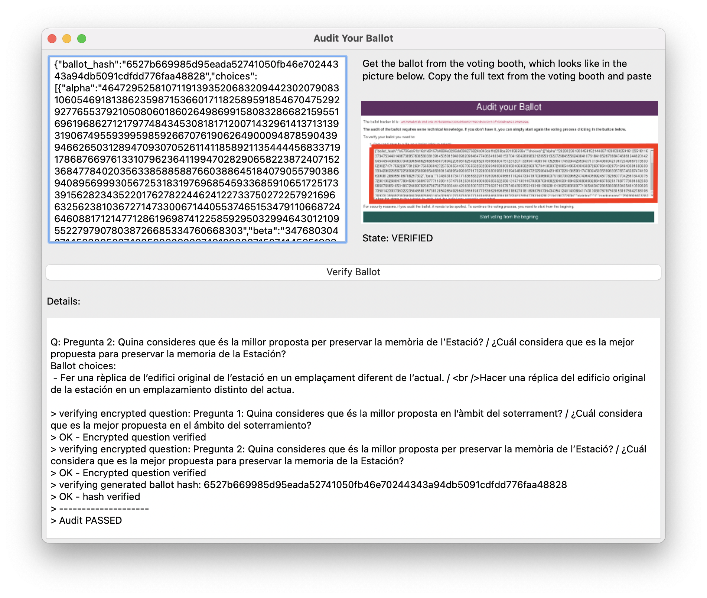

<!--
SPDX-FileCopyrightText: 2014 Félix Robles <felrobelv@gmail.com>
SPDX-FileCopyrightText: 2021 Eduardo Robles <edulix@nvotes.com>

SPDX-License-Identifier: AGPL-3.0-only
-->

# agora-airgap



The agora-airgap project is nVotes cast-as-intended verifier. It allows a voter
to audit a spoiled ballot.

This software implements the 'cast or cancel' procedure described on the paper
[Ballot Casting Assurance via Voter-Initiated Poll Station Auditing] by Josh
Benaloh.

## Install

agora-airgap works in Linux and Mac OS X 64 bits systems. You can download the
latest (4.0.1 version) compiled version for the GUI utility (agora-airgap-gui)
here:

- [Linux binary]
- [Mac OS X binary]

## How to use

The `agora-airgap-gui` tool has a textbox on the upper left side where you should copy
the ballot. Before you cast your vote in nVotes voting booth, you are allowed to
audit the ballot. Note that this also discards the ballot for security reasons.
The upper right side of agora-airgap shows you a screen capture of the audit
ballot screen and marks the place where you will find the auditable ballot
enclosed with a red box.

Once you have copied and pasted the auditable ballot to agora-airgap, you should
click the **Verify Ballot** button. If the ballot is verified, the state
indicator below should change to State: VERIFIED. There is also a console below
the Details label that shows more information.

## Compiling

As an alternative to just downloading the pre-compiled tool, you can compile it
yourself from the source code. 

agora-airgap uses [Nix Package Manager] as its package builder. To build 
agora-airgap, **first [install Nix]** correctly in your system.

After you have installed Nix, you can build agora-airgap executing the following
command in the agora-airgap main directory:

```bash
nix build -L
```

After a succesful build, you can find the built `agora-airgap-gui` and 
`agora-airgap` binaries in the `result/bin/` output directory.

```bash
$ ls -lah result/bin/  
total 1176
dr-xr-xr-x  4 root  wheel   128B Jan  1  1970 .
dr-xr-xr-x  3 root  wheel    96B Jan  1  1970 ..
-r-xr-xr-x  1 root  wheel   227K Jan  1  1970 agora-airgap
-r-xr-xr-x  1 root  wheel   356K Jan  1  1970 agora-airgap-gui
```

#  agora-airgap-gui tool

You can just execute any of these binaries from the command line. For example,
you can use the GUI utility with:

```bash
./result/bin/agora-airgap-gui
```
# agora-airgap tool

The `agora-airgap` binary is a command line utility that includes a set of
commands:
 
- **download-audit**: This command needs a file with an auditable ballot as an
  argument. It will download the public keys and the election data for that
  voting and then it will audit the ballot.

- **download**: This command needs a file with an auditable ballot as an
  argument, as well as the paths where the public keys and election data files
  will be stored. It will download the public keys and the election data for
  that voting.

- **audit**: This command needs a file with an auditable ballot, the public keys
  file and the election data file as arguments. It will audit the ballot
  offline, without the need of an internet connection.

- **encrypt**: This command needs a file with a plaintext ballot, the public
  keys file and the election data file as arguments. 

Executing the download and audit commands achieve the same result as only
executing the single command download-audit, but the strength of separating the
steps is that the audit command can be executed in a separate, secure computer
that doesn't need to have an internet connection. 

The audit command is useful to audit a ballot from the 'cast or cancel'
paradigm. That auditable ballot is obtained from a cancelled vote from that
procedure and you are not auditing the votes that are being casted, but the
software that creates them: the 'cast or cancel' is a statistical verification
procedure.

On the other hand, the encrypt command lets you encrypt a ballot that you can
cast afterwards and it lets you encrypt that ballot in a computer without
internet connection, on your own trustworthy airgap computer. While the security
scheme of nVotes is quite strong, in the end the election authorities cannot
control the end-user computer. By encrypting the ballot on an airgap computer
the risks are minimized, and the aim here is to ease the task of encrypting the
vote in a safe environment, but it is your responsability to ensure that the
computer you are using to encrypt your vote is not compromised.

## Audit example

To audit the auditable ballot `tests/fixtures/example_1/auditable_ballot.json`
whose election configuration is in `tests/fixtures/example_1/config`, just
execute:

```bash
./result/bin/agora-airgap audit \
  tests/fixtures/example_1/auditable_ballot.json \
  tests/fixtures/example_1/config
```

You should see the following output:

```
> reading auditable ballot
> election data loaded (hash: 995cbc4c68fcba699f2f19ee08b5bca5827f89723667b7473efa444c121acbb6)
> parsing... (12766 characters)
> election data configuration (hash: 8d63d93b4011269d625631656e61fbe6515a97a7afa54902faceff7e932410f5)
> parsing... (2139 characters)
> please check that the showed options are the ones you chose:

Q: Secretario General
Ballot choices:
 - Mari Pili Hernández Ordoñez
 - Juan Y Medio


Q: Consejo Ciudadano
Ballot choices:
 - Vicente Bizancio Castillo
 - Argos de la Cruz
 - Gorrión Turrón Pastel

> verifying encrypted question: Secretario General
> OK - Encrypted question verified
> verifying encrypted question: Consejo Ciudadano
> OK - Encrypted question verified
> verifying generated ballot hash: 0ed250df1c2183f01a1485ade9deb5bba192234f148b1c40d309ada774eaea02
> OK - hash verified
> --------------------
> Audit PASSED
```

## Generating auditable ballot

You could generate an auditable ballot with `agora-airgap encrypt` utility. This
is useful for testing, and you can even use it to generate some of the fixtures
in the unit tests. The input for the encrypt command are three file paths:

1. The path to the JSON plaintext ballot. You can see an example in 
   `tests/fixtures/example_1/plaintext_vote.json`.
2. The path to the JSON election configuration. An example is available in
    `tests/fixtures/example_1/config`.
3. The path where to write the auditable encrypted ballot. An example is
    available in `tests/fixtures/example_1/auditable_ballot.json`, but you need
    to use a path to a file that does not yet exist because it's the output of
    the command.

For example you could execute:

```bash
./result/bin/agora-airgap encrypt \
  tests/fixtures/example_1/plaintext_vote.json \
  tests/fixtures/example_1/config \
  auditable_ballot.json
```

This will write the auditable ballot into the `auditable_ballot.json` file. The
command output will be something like:

```
> reading plaintext ballot
> reading config file
> generating encrypted ballot
> plaintext = 48
> randomness = 20697118667460294289329131926842862371260858718961622542390394128577965883462065464726476265621500584422101090324880590478894205064526853437187125765172491285762485391331954466581845397077420580593627651323516780475733067117136022933691007420276684081952396408441155446026400666835986702419934866824441890364774228140899158959010059757494492005981153055872187442495482411745134646120584804555929554183515697922429188623722060569894871268972465008089744410453542328276620895938777704297176988032776203315585798048230323891888933392698520362991482313522285535354701685917388200178015927229730825614585660545884722373680
> Node: proof verified = true
> plaintext = 14
> randomness = 3456911345997611543186335774236642630390842020472509711960786133719991332236726819176112979051362607948915758116037716151903284624481210739245853172134120897860726118582645515585212567439994880303292970782861566292504471353287509073429239770291906349190705539953101260197845807846471263353036654426734634504378976678634863792508644960200468286363612768956980083081802293861845114229879669587192461023056157772744159354341811340475380918027646382465164417974193141204220125606518846729681559895493110140973562320152361785050101010897028087514924680564956680724209020115799073793869391224843341653567950726461756196000
> Node: proof verified = true
> saving encrypted ballot to file...
> writing to file auditable_ballot.json
```

# Contributing

Contributions are welcome! We'd love to include your improvements to our
project. Please make sure you:
- Sign the [Contributor License Agreement].
- All the tests in the [Contin uous Integration] github Actions pipeline are 
green.

## Code structure

The following is a brief explanation of the tree structure of the repository:

```
agora-airgap/
├── CMakeLists.txt                          << Main Configuration file for CMake
├── Format.cmake/                           << CMake config for clang-format
│   └── ...
├── LICENSE                                 << Main License (AGPL-v3.0)
├── LICENSES/                               << License files used by reuse
│   └── ...
├── README.md                               << This file
├── apps/                                   << The code of the app is here
│   ├── CMakeLists.txt                      << CMake configuration for the app
│   ├── interface.cpp                       << GUI source code
│   ├── interface.h                         << GUI source code header
│   └── main.cpp                            << CLI (Currently Unused)
├── cmake/                                  << CMake files to find some deps
│   ├── FindGMP.cmake
│   └── FindGMPXX.cmake
├── flake.nix                               << Build configuration file for Nix
├── include/                                << Headers for our libraries
│   └── agora-airgap/                       << Header for agora-airgap lib
│       ├── ElGamal.h
│       ├── ...
│       └── sha256.h
├── python/                                 << some currently unused python code
├── src/                                    << source code of the library
│   ├── CMakeLists.txt                      << CMake configuration for the app
│   ├── ElGamal.cpp
│   ├── Random.cpp
│   ├── encrypt.cpp
│   ├── screen.png                          << image used in the GUI
│   ├── screen.png.license                  << reuse license header for screen.png file
│   ├── sha256.cpp
└── tests/                                  << Unit tests
    ├── CMakeLists.txt
    ├── fixtures/                           << Fixture used in some unit tests 
    │   ├── example_1/                      << Each fixture has its own dir
    │   │   ├── auditable_ballot.json       << Auditable Ballot of the fixture
    │   │   ├── auditable_ballot.json.license
    │   │   ├── config                      << election configuration
    │   │   ├── config.license              << reuse license header for config
    │   │   ├── expectations.json           << fixture expectations for unit tests
    │   │   ├── expectations.json.license   
    │   │   ├── pk_1                        << public keys of election 1
    │   │   ├── pk_1.license
    │   │   ├── pk_1110                     << public keys for election 1110
    │   │   ├── pk_1110.license
    │   │   ├── votes.json                  << currently unused
    │   │   └── votes.json.license
    |   └─── ...                            << more fixtures
    ├── tests.cpp                           << unit tests
    └── update_fixtures.sh                  <<| updates the fixtures, as some  
                                              | are copies of example_1/ unit 
                                              | test.
```

## Dependencies

`agora-airgap` is developed in C++11. It uses the following tools:
- [git] and [GitHub] for source code control.
- [Nix Package Manager] for building a Nix [flake].
- [cmake] as the C++ code building tool.
- [ninja] as a building tool and target for cmake.
- [reuse] to checks that all files have a correct copyright headers (for code
  quality).
- [clang-format] to check code styling (for code quality).
- [cppcheck] to run C++ static code analysis (for code quality).

`agora-airgap` uses the following libraries:
- [rapidjson] as a library for processing JSON data.
- [Crypto++] as a library to execute cryptographic operations.
- [gmplib] as a library for modular exponentiation.
- [googletest] as a library to create unit tests.
- [wxWidgets] as the GUI library.

## Configuring the Development

agora-airgap uses [Nix Package Manager] as its package builder. To build 
agora-airgap, **first [install Nix]** correctly in your system.

After you have installed Nix, you can build agora-airgap executing the following
command in the agora-airgap main directory:

## Continuous Integration

A Continuous Integration (CI) pipeline has been setup to be executed everytime
someone pushes into master or a stable branch or into a branch that should be
merged into those.

The CI pipeline includes the following tasks:
- Builds the Nix Flake for Linux and Mac OS X.
- Compiles the code with -Wall and any warning will fail.
- Executes all unit tests in Linux and Mac OS X.
- Archives the generated artifacts (the flake).
- Checks that all files have a correct copyright header with [reuse].
- Checks code styling with [clang-format].
- Executes C++ static code analysis with [cppcheck].

Refer to the `.github/workflows/build.yml` for more information on each of the
steps.

## Fixtures and unit tests

Some of the fixtures are based on other fixtures. For example
`example_1__invalid_choice_alpha` is based on `example_1`. The changes are
applied by the `update_fixture.sh` on the example directory, resetting the
fixture directory to be a copy of the source fixture and applying the 
corresponding changes. Typically, the `expectations.json` file is not copied
from the source fixture and instead is taylored for the specific fixture.

The `expectations.json` file is used within the unit test as the source for
expectations specific to that fixture for a given unit test.

## The screen.h file

The file `include/agora-airgap/screen.h` includes the PNG found in
`src/screen.png` file. The `screen.h` has been generated with the [bin2c tool].

[Ballot Casting Assurance via Voter-Initiated Poll Station Auditing]: https://www.usenix.org/legacy/event/evt07/tech/full_papers/benaloh/benaloh.pdf
[Linux binary]: https://github.com/agoravoting/agora-airgap/releases/download/0.50/agora-airgap-windows.zip
[Mac OS X binary]: https://github.com/agoravoting/agora-airgap/releases/download/3.4.0agora-airgap-linux-3.4.0.tar.gz
[Nix Package Manager]: https://nixos.org/
[install Nix]: https://nixos.org/
[bin2c tool]: https://github.com/gwilymk/bin2c
[Contributor License Agreement]: https://agoravoting.github.io/admin-manual/docs/contribute/guide
[reuse]: https://reuse.software/
[clang-format]: https://releases.llvm.org/7.1.0/tools/clang/docs/ClangFormatStyleOptions.html
[cppcheck]: https://cppcheck.sourceforge.io
[flake]: https://nixos.wiki/wiki/Flakes
[rapidjson]: https://rapidjson.org/
[Crypto++]: https://cryptopp.com/
[ninja]: https://ninja-build.org/
[gmplib]: https://gmplib.org/
[googletest]: https://github.com/google/googletest
[wxWidgets]: https://www.wxwidgets.org/
[git]: https://github.com/agoravoting/agora-airgap/
[GitHub]: https://github.com/agoravoting/agora-airgap/
[Linux binary]: https://github.com/agoravoting/agora-airgap/releases/download/4.0.1/agora-airgap-gui-linux
[Mac OS X binary]: https://github.com/agoravoting/agora-airgap/releases/download/4.0.1/agora-airgap-gui-mac